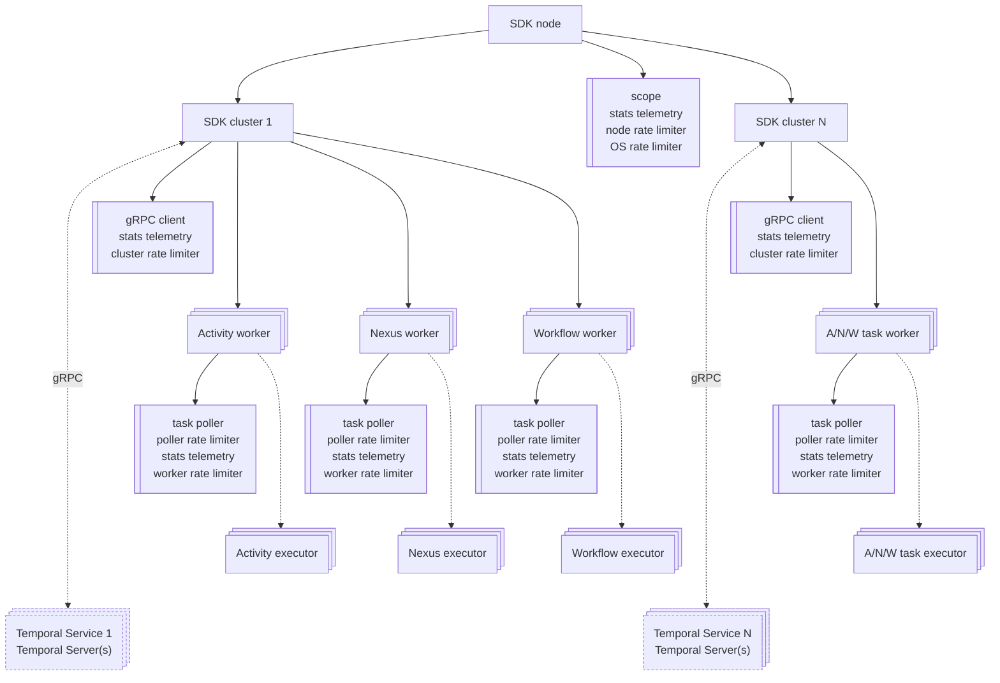

# SDK Architecture

## Workflow Execution Scope

After the user starts workflow execution by calling `TemporalSdk.start_workflow/3` or
`:temporal_sdk.start_workflow/3`, the given SDK cluster sends a `StartWorkflowExecutionRequest` gRPC
request to the Temporal service Temporal server.
The Temporal server schedules the new workflow task execution on a user-defined workflow task queue.
The workflow task execution is then polled from the Temporal server by the SDK workflow task worker
polling given workflow task queue.
Workflow task workers typically run across multiple worker hosts within the user's cluster.
After a new workflow task execution is polled, the SDK is responsible for processing the polled
workflow task execution with workflow task executor.
The Temporal server may dispatch the given workflow task execution to one or more user cluster hosts
running workflow task workers.

Majority of other Temporal SDK implementations use the concept of
["Worker Task Slots"](https://docs.temporal.io/develop/worker-performance#slots) when processing task
executions.
After a new task execution is polled from a task queue by the SDK, task execution is
cached and executed on each host that polled for the new task.
If the Temporal server dispatches a task to multiple user cluster hosts, other Temporal SDK
implementations will cache and execute the polled task on each involved worker host.
This strategy may result in storing duplicate task data and executing the same task code across
multiple worker hosts.

This SDK utilizes Erlang OTP distribution to optimize Temporal workflow task execution.
If `enable_single_distributed_workflow_execution` `m::temporal_sdk_node` configuration option is set
to true (default and recommended value), after polling a new workflow task execution from Temporal server,
the SDK will check whether the given workflow task execution is already being processed by a workflow
task executor on any SDK node within the Erlang cluster.
If there is already a workflow executor processing the given workflow task execution, the polled
workflow task data is sent to that workflow executor.
The workflow executor, upon receiving a polled workflow execution task, validates the integrity of the
received workflow task, particularly by comparing the polled task's event history with its internal
executor event history.
If the polled task integrity checks pass, the workflow executor appends the newly polled workflow task
execution events history and proceeds with the workflow task execution.
If no workflow executors are found processing polled workflow task execution, a new workflow task
executor process is spawned on the local Erlang node.
Task executor processes are not supervised by OTP. Task executions are supervised by the Temporal
server using timeout-based mechanisms.

In the event of a split-brain state in the Erlang cluster, workflow executors are started on all
isolated Erlang cluster partitions Erlang nodes that polled workflow task execution.
Each workflow task executor will progress with workflow task execution until the workflow task
transitions to a closed state or another workflow executor advances the workflow execution further.
The optimization described above is performed on a best-effort basis.
If the Temporal server dispatches workflow task execution to multiple Erlang nodes, at least one
workflow task execution will be processed by the SDK in the Erlang cluster.

If `enable_single_distributed_workflow_execution` configuration option is set to false (not recommended),
after polling a new workflow task execution, the SDK will check whether the given workflow task
execution is already being processed by any workflow task executor running on the local node.
If there is already a workflow executor processing the given workflow task execution, the polled
workflow task will be sent to that workflow executor, otherwise a new workflow executor process is
spawned on local Erlang node.

SDK uses sharded `m::pg` process groups to register workflow task executors across the Erlang cluster
nodes.
`scope_config` `m::temporal_sdk_node` SDK node configuration option is used to specify the number of
process group shards per SDK cluster.
The default number of process group shards is set to 10, which should be sufficient for most use cases.
