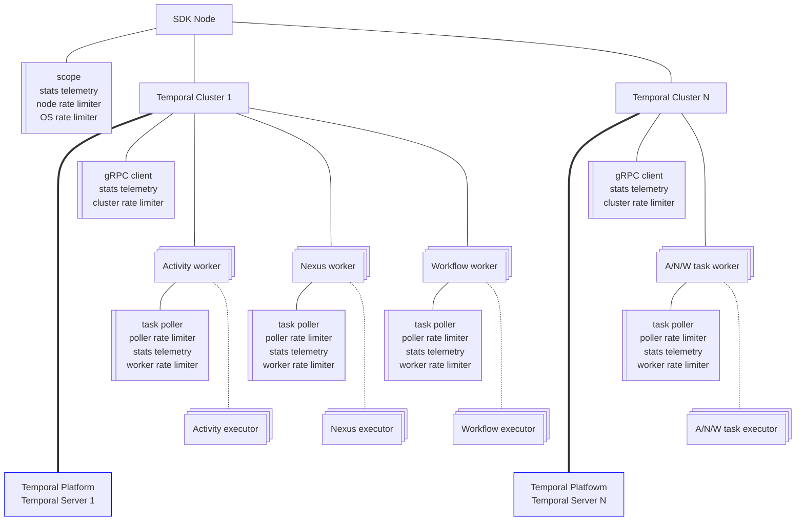

# SDK architecture

```mermaid
flowchart TD
  Node@{ shape: rect, label: "SDK Node"}
  NodeTool@{ shape: lin-rect, label: "scope <br> stats telemetry <br> node rate limiter <br> OS rate limiter"}

  Cluster1@{ shape: rect, label: "Temporal Cluster 1"}
  ClusterN@{ shape: rect, label: "Temporal Cluster N"}
  ClusterTool@{ shape: lin-rect, label: "gRPC client <br> stats telemetry <br> cluster rate limiter"}
  ClusterToolN@{ shape: lin-rect, label: "gRPC client <br> stats telemetry <br> cluster rate limiter"}

  Activity@{ shape: processes, label: "Activity worker" }
  ActivityTool@{ shape: lin-rect, label: "task poller <br> poller rate limiter <br> stats telemetry <br> worker  rate limiter" }

  Nexus@{ shape: processes, label: "Nexus worker" }
  NexusTool@{ shape: lin-rect, label: "task poller <br> poller rate limiter <br> stats telemetry <br> worker  rate limiter" }

  Workflow@{ shape: processes, label: "Workflow worker" }
  WorkflowTool@{ shape: lin-rect, label: "task poller <br> poller rate limiter <br> stats telemetry <br> worker  rate limiter" }

  Task@{ shape: processes, label: "A/N/W task worker" }
  TaskTool@{ shape: lin-rect, label: "task poller <br> poller rate limiter <br> stats telemetry <br> worker rate limiter" }

  ActivityExec@{ shape: processes, label: "Activity executor" }
  NexusExec@{ shape: processes, label: "Nexus executor" }
  WorkflowExec@{ shape: processes, label: "Workflow executor" }
  TaskExec@{ shape: processes, label: "A/N/W task executor" }

  TemporalServer1@{ shape: rect, label: "Temporal Platform <br> Temporal Server 1"}
  TemporalServerN@{ shape: rect, label: "Temporal Platfowm <br> Temporal Server N"}

  style TemporalServer1 stroke:#0000ff
  style TemporalServerN stroke:#0000ff

  Node --- NodeTool
  Node --- Cluster1
  Cluster1 ======= TemporalServer1
  Cluster1 --- ClusterTool
  Cluster1 ---- Activity
  Cluster1 ---- Nexus
  Cluster1 ---- Workflow
  Node --- ClusterN
  ClusterN ======= TemporalServerN
  ClusterN --- ClusterToolN
  ClusterN ---- Task
  Activity --- ActivityTool
  Activity -..- ActivityExec
  Nexus --- NexusTool
  Nexus -..- NexusExec
  Workflow --- WorkflowTool
  Workflow -..- WorkflowExec
  Task --- TaskTool
  Task -..- TaskExec

  click Node "https://hexdocs.pm/temporal_sdk/temporal_sdk_node.html" _blank
  click NodeTool "https://hexdocs.pm/temporal_sdk/temporal_sdk_node.html" _blank

  click Cluster1 "https://hexdocs.pm/temporal_sdk/temporal_sdk_cluster.html" _blank
  click ClusterN "https://hexdocs.pm/temporal_sdk/temporal_sdk_cluster.html" _blank
  click ClusterTool "https://hexdocs.pm/temporal_sdk/temporal_sdk_cluster.html" _blank
  click ClusterToolN "https://hexdocs.pm/temporal_sdk/temporal_sdk_cluster.html" _blank

  click Activity "https://hexdocs.pm/temporal_sdk/temporal_sdk_worker.html" _blank
  click ActivityTool "https://hexdocs.pm/temporal_sdk/temporal_sdk_worker.html" _blank
  click Nexus "https://hexdocs.pm/temporal_sdk/temporal_sdk_worker.html" _blank
  click NexusTool "https://hexdocs.pm/temporal_sdk/temporal_sdk_worker.html" _blank
  click Workflow "https://hexdocs.pm/temporal_sdk/temporal_sdk_worker.html" _blank
  click WorkflowTool "https://hexdocs.pm/temporal_sdk/temporal_sdk_worker.html" _blank
  click Task "https://hexdocs.pm/temporal_sdk/temporal_sdk_worker.html" _blank
  click TaskTool "https://hexdocs.pm/temporal_sdk/temporal_sdk_worker.html" _blank

  click ActivityExec "https://hexdocs.pm/temporal_sdk/temporal_sdk_activity.html" _blank
  click NexusExec "https://hexdocs.pm/temporal_sdk/temporal_sdk_nexus.html" _blank
  click WorkflowExec "https://hexdocs.pm/temporal_sdk/temporal_sdk_workflow.html" _blank

  click TemporalServer1 "https://docs.temporal.io/temporal" _blank
  click TemporalServerN "https://docs.temporal.io/temporal" _blank


```
