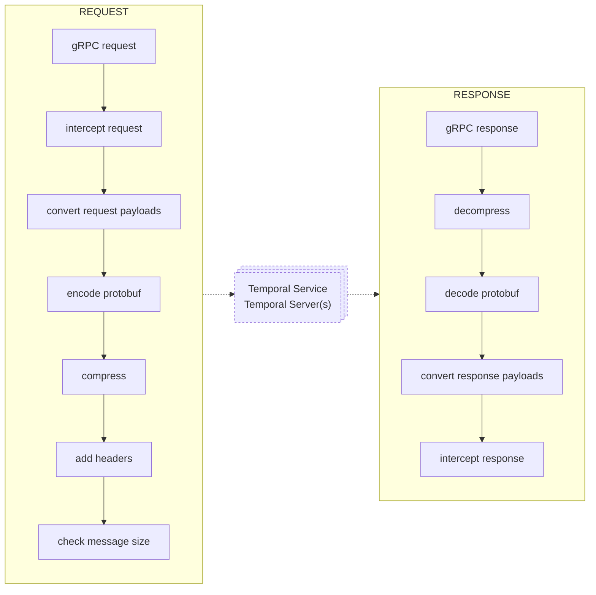

gRPC request module.

gRPC request module provides unary gRPC request functionality.
Module is used by the `m:temporal_sdk_client` module.
Functions provided by the `m:temporal_sdk_api` module should be used for low-level gRPC request
handling; see `temporal_sdk_api:request/3` and `temporal_sdk_api:request/5`.

## gRPC request life cycle

